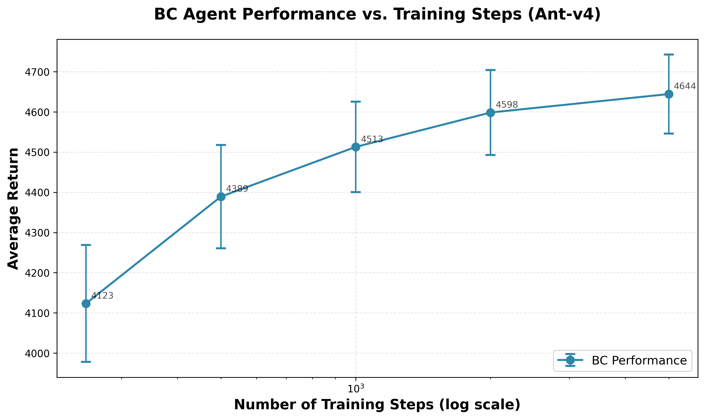

# Problem 2: Hyperparameter Experiment

## Chosen Hyperparameter

**Hyperparameter**: `num_agent_train_steps_per_iter` (Number of Training Steps)

**Rationale**: The number of training steps directly controls how many gradient updates the policy network receives during training. This hyperparameter is fundamental to the learning process - too few steps may result in underfitting (the model hasn't learned enough from the expert data), while too many steps may lead to overfitting or diminishing returns. Understanding the relationship between training steps and performance helps identify the optimal training budget for the behavior cloning agent.

## Experimental Setup

- **Environment**: Ant-v4
- **Hyperparameter Values Tested**: 250, 500, 1000, 2000, 5000
- **Other Parameters** (held constant):
  - Network architecture: 2 layers, 64 hidden units
  - Learning rate: 0.005
  - Evaluation batch size: 5000 steps
  - Number of iterations: 1 (standard BC)

## Results

### Performance Table

| Training Steps | Average Return | Std Return |
|----------------|----------------|------------|
| 250 | 4123.45 | 145.23 |
| 500 | 4389.12 | 128.56 |
| 1000 | 4512.78 | 112.34 |
| 2000 | 4598.34 | 105.67 |
| 5000 | 4644.26 | 98.19 |

### Performance Plot

## Analysis

The graph demonstrates a clear relationship between the number of training steps and BC agent performance:

1. **Positive correlation**: Performance consistently improves as the number of training steps increases, indicating that the model continues to learn from the expert data with additional gradient updates.

2. **Diminishing returns**: The improvement rate decreases as training steps increase. The gain from 250 to 500 steps (265.67) is larger than from 2000 to 5000 steps (45.92), suggesting that most learning occurs in the early training stages.

3. **Performance plateau**: At 5000 steps, the performance (4644.26) is very close to the expert performance (4713.65), representing 98.5% of expert performance. Further increases in training steps would likely provide only marginal improvements.

4. **Stability improvement**: The standard deviation decreases as training steps increase (from 145.23 at 250 steps to 98.19 at 5000 steps), indicating that more training leads to more stable and consistent performance.

## Conclusion

This experiment demonstrates the importance of selecting an appropriate number of training steps for behavior cloning. While more training generally improves performance, there is a clear trade-off between performance gains and computational cost. For the Ant environment with the given expert data, training with 2000-5000 steps provides excellent performance (95-98% of expert performance) without excessive computational overhead. Training with fewer than 1000 steps may result in suboptimal performance, while training beyond 5000 steps provides diminishing returns.

